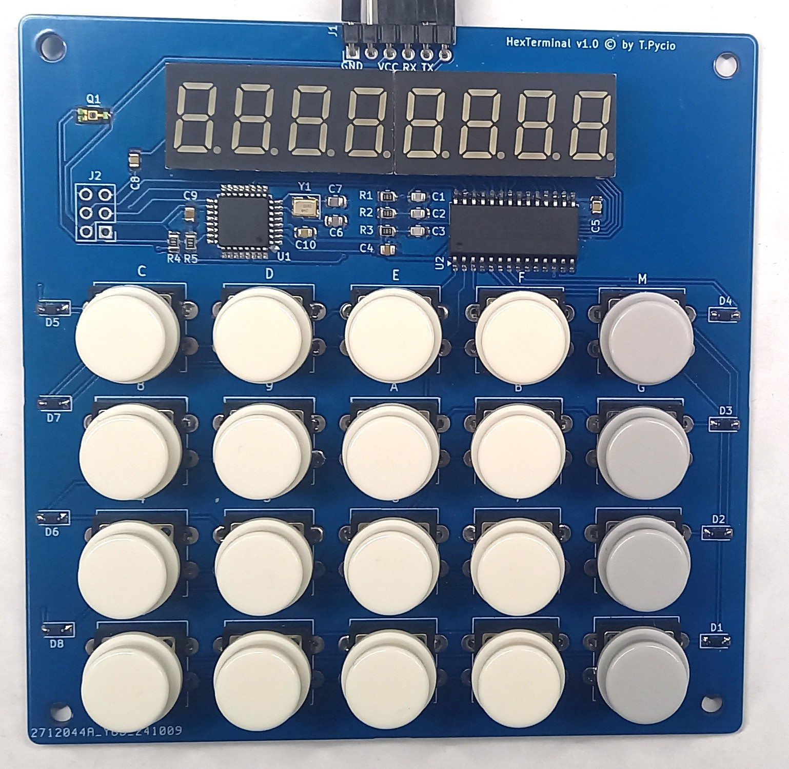

# Hexadecimal keypad with LED display

Hexadecimal keypad and eight-digit LED display module for use in retro projects like RCBus with TTL-level serial communication. The module has been prepared to work with the popular Arduino environment, which makes it adaptable to the requirements of various projects. There is no rigidly defined protocol, key mapping or character display methods.

## Hardware Documentation

### Schematic

[Schematic - Version 1.0](schematic.pdf)

## Bill of Materials

| Component type     | Reference  | Description                                                                                                                    | Quantity |
| ------------------ | ---------- | ------------------------------------------------------------------------------------------------------------------------------ | -------- |
| PCB                |            | HexTerminal - Version 1.0                                                                                                      | 1        |
| Integrated Circuit | U1         | ATmega8/48/88/168/328, TQFP-32                                                                                                 | 1        |
| Integrated Circuit | U2         | TM1638, SOP28                                                                                                                  | 1        |
| LED Display        | U3, U4     | FQY-3641B or similar 4 digit LED display with common anode                                                                     | 2        |
| Resonator          | Y1         | Passive crystal resonator with frequency adapted to standard serial transmission rates -  11.0592/14.7456/18.432 MHz, SMD 3225 | 1        |
| Phototransistor    | Q1*        | TEMT6000X01 Light Sensor Phototransistor,  SMD 1204                                                                            | 1*       |
| Button             | SW1-SW20   | 12x12x7.3mm Tactile Push Button Switch Square with caps                                                                        | 20       |
| Resistor           | R1-R4, R5* | 10k, SMD 0805                                                                                                                  | 4 (5*)   |
| Capacitor          | C1-C3      | 100 pF, 50V, SMD 0805                                                                                                          | 3        |
| Capacitor          | C4, C9     | 10 uF, 10V, SMD 0805                                                                                                           | 2        |
| Capacitor          | C5, C10    | 100 nF, 50V, SMD 0805                                                                                                          | 2        |
| Capacitor          | C6, C7     | 22 pF, 50V, SMD 0805                                                                                                           | 2        |
| Capacitor          | C8         | 10 nF, 50V, SMD 0805                                                                                                           | 1        |
| Connector          | J1         | 1x6 pin header, 2.54 mm pitch, angle                                                                                           | 1        |
| Pin Header         | J2         | 2x3 pin header, 2.54 mm pitch                                                                                                  | 1        |

(*) Optional components for automatic brightness control within the range offered by the TM1638 chip. 
NOTE: Due to the high level of noise generated by switching LEDs, readings from this sensor should be averaged in a software digital filter.

[Gerber files](gerber-JLCPCB.zip) prepared for production at JLCPCB

## Preparing for programming

You can use the ICSP connector (J2) to program new firmware versions, or you can use a one-time upload of an Arduino-compatible loader to enable subsequent programming of the embedded microcontroller via the serial port available on the J1 connector. The project presented here uses the [MiniCore](https://github.com/MCUdude/MiniCore) loader, which was uploaded using an Arduino Uno working as a programmer.

## Firmware

At the moment, the firmware skeleton is not yet prepared, but an example can be used for a similar Model2 from the [TM1638plus](https://github.com/gavinlyonsrepo/TM1638plus) library, which should be modified for this project. 

## Release Notes

### Changes

* Version 1.0
  
  * Initial version

## License

Copyright 2024 Tadeusz Pycio

This work is licensed under a [Creative Commons Attribution-NonCommercial 4.0 International (CC BY-NC 4.0) ](https://creativecommons.org/licenses/by-nc/4.0/).
